# Tugas 3: EDA dan Data Visualization

**Dataset:** Student Exam Performance

**Nama:** Salman Rachmadi (203012420009)

**Universitas:** Telkom University, 2026

---

## Daftar Isi

1. [Pendahuluan](#1-pendahuluan)
2. [Karakteristik Dataset yang Paling Penting](#2-karakteristik-dataset-yang-paling-penting)
   - 2.1 [Severe Class Imbalance pada grade_category](#21-severe-class-imbalance-pada-grade_category)
   - 2.2 [Multikolinearitas Tinggi antar Subject Scores dan Target](#22-multikolinearitas-tinggi-antar-subject-scores-dan-target)
   - 2.3 [Target Variables yang Saling Terkait (Derived Targets)](#23-target-variables-yang-saling-terkait-derived-targets)
   - 2.4 [Dataset Bersih dan Sintetis](#24-dataset-bersih-dan-sintetis)
   - 2.5 [Ringkasan Karakteristik](#25-ringkasan-karakteristik)
3. [Metode EDA dan Visualisasi yang Paling Penting](#3-metode-eda-dan-visualisasi-yang-paling-penting)
   - 3.1 [Correlation Heatmap & Correlation Bar Chart](#31-correlation-heatmap--correlation-bar-chart)
   - 3.2 [Class Distribution Bar Chart](#32-class-distribution-bar-chart)
   - 3.3 [Scatter Plot & Regression Plot](#33-scatter-plot--regression-plot)
   - 3.4 [Box Plot untuk Outlier Detection](#34-box-plot-untuk-outlier-detection)
   - 3.5 [Ringkasan Prioritas Metode EDA](#35-ringkasan-prioritas-metode-eda)
4. [Kesimpulan](#4-kesimpulan)

---

## 1. Pendahuluan

Laporan ini menyajikan analisis kritis terhadap proses Exploratory Data Analysis (EDA) dan Data Visualization yang dilakukan pada dataset Student Exam Performance. Dataset ini berisi 10.000 record siswa dengan 23 fitur yang mencakup informasi demografis, perilaku belajar, dan performa akademik siswa.

Laporan ini menjawab dua pertanyaan utama:

- **Pertanyaan 1:** Karakteristik dataset apa yang paling penting, dan mengapa?
- **Pertanyaan 2:** Jenis metode EDA atau visualisasi apa yang paling penting, dikaitkan dengan task yang diselesaikan pada dataset tersebut serta karakteristik penting dataset?

Dataset ini memiliki tiga target variable yang mendukung tiga jenis task machine learning:

- `final_exam_score`, digunakan untuk task **regresi** dalam memprediksi nilai ujian akhir.
- `pass_fail`, digunakan untuk task **klasifikasi biner** dalam memprediksi kelulusan.
- `grade_category` (A/B/C/D/F), digunakan untuk task **klasifikasi multi-kelas**.

---

## 2. Karakteristik Dataset yang Paling Penting

Terdapat empat karakteristik kunci yang paling menentukan bagaimana dataset ini harus dianalisis dan dimodelkan. Keempat karakteristik ini bukan sekadar deskripsi data, melainkan faktor-faktor yang secara langsung mempengaruhi keberhasilan atau kegagalan proses modeling.

### 2.1 Severe Class Imbalance pada grade_category

Karakteristik yang **paling kritis** dalam dataset ini adalah ketidakseimbangan kelas (class imbalance) yang sangat parah pada variabel target `grade_category`.

| Grade | Jumlah | Persentase |
|-------|--------|------------|
| F     | 5.172  | 51,7%      |
| D     | 3.829  | 38,3%      |
| C     | 904    | 9,0%       |
| B     | 85     | 0,9%       |
| A     | 10     | 0,1%       |

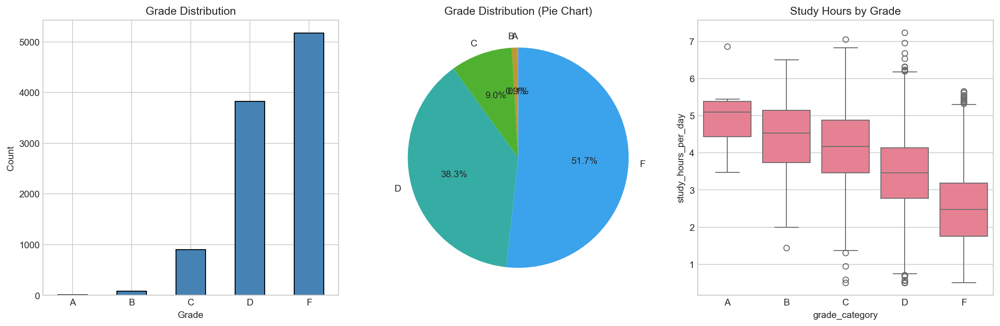
*Gambar 1. Distribusi Kategori Grade yang Menunjukkan Severe Class Imbalance*

**Mengapa ini penting:** Kelas A hanya memiliki 10 sampel dari 10.000 total data. Sebuah model multi-class bisa mendapatkan akurasi 90% hanya dengan selalu menebak D atau F tanpa benar-benar "belajar" pola dari data. Hal ini menjadikan metrik accuracy menjadi **menyesatkan** (misleading) dan membutuhkan strategi khusus seperti SMOTE (Synthetic Minority Over-sampling Technique), penggunaan class weights, atau penggabungan kelas.

---

### 2.2 Multikolinearitas Tinggi antar Subject Scores dan Target

Empat subject scores (math, reading, writing, science) saling berkorelasi tinggi satu sama lain (r = 0,67–0,73), dan semuanya berkorelasi sangat tinggi dengan `final_exam_score` (r > 0,86). Begitu pula `previous_gpa` yang memiliki korelasi r = 0,89 dengan target.

|           | Math  | Reading | Writing | Science |
|-----------|-------|---------|---------|---------|
| **Math**      | 1,000 | 0,697   | 0,704   | 0,675   |
| **Reading**   | 0,697 | 1,000   | 0,725   | 0,701   |
| **Writing**   | 0,704 | 0,725   | 1,000   | 0,700   |
| **Science**   | 0,675 | 0,701   | 0,700   | 1,000   |

*Tabel 1. Matriks Korelasi antar Subject Scores*

**Mengapa ini penting:** Multikolinearitas menyebabkan tiga masalah utama:

1. **Redundansi fitur.** Memasukkan semua subject scores ke dalam model dapat meng-inflate performa tanpa menambah informasi baru.
2. **Koefisien model linear tidak stabil.** Koefisien menjadi sulit diinterpretasi karena fitur-fitur saling "berbagi" pengaruh.
3. **Potensi data leakage.** Jika subject scores dihitung bersamaan atau setelah final exam, maka menggunakannya sebagai prediktor tidaklah realistis dalam skenario prediksi nyata.

---

### 2.3 Target Variables yang Saling Terkait (Derived Targets)

Dataset memiliki tiga target variable yang sebenarnya **bukan independen** satu sama lain:

- `final_exam_score` → variabel kontinu (untuk regresi)
- `pass_fail` → diturunkan secara deterministik dari `final_exam_score` (Pass ≥ 50, Fail < 50)
- `grade_category` → diturunkan secara deterministik dari `final_exam_score` (A ≥ 91, B ≥ 80, C ≥ 65, D ≥ 50, F < 50)

Berikut verifikasi hubungan deterministik tersebut:

| Grade | Min Score | Max Score |
|-------|-----------|-----------|
| A     | 91,7      | 97,8      |
| B     | 80,1      | 90,0      |
| C     | 65,1      | 80,0      |
| D     | 50,1      | 65,0      |
| F     | 4,4       | 50,0      |

*Tabel 2. Verifikasi Hubungan Deterministik grade_category dan final_exam_score*

**Mengapa ini penting:** Jika ketiga target ada dalam dataset secara bersamaan saat training, maka menggunakan `final_exam_score` untuk memprediksi `pass_fail` atau `grade_category` (atau sebaliknya) adalah **data leakage langsung**. Kondisi inilah yang menjelaskan mengapa model multi-class mendapatkan akurasi 100%. Model tersebut bukan "pintar", melainkan hanya menemukan rumus derivasi yang sudah tertanam dalam data. Oleh karena itu, dalam EDA sangat penting untuk mengidentifikasi hubungan deterministik ini **sebelum** memulai modeling.

---

### 2.4 Dataset Bersih dan Sintetis

Dataset ini tidak memiliki missing values, tidak ada duplikat, dan outlier sangat minimal (kurang dari 1% untuk sebagian besar fitur). Distribusi kebanyakan fitur hampir simetris dengan nilai skewness mendekati 0.

| Fitur | Skewness | Interpretasi |
|-------|----------|--------------|
| study_hours_per_day | 0,068 | Simetris |
| attendance_rate | -0,322 | Sedikit left-skewed |
| sleep_hours | 0,006 | Simetris |
| social_media_hours | 0,258 | Sedikit right-skewed |
| final_exam_score | 0,117 | Simetris |
| previous_gpa | 0,066 | Simetris |
| online_courses_completed | 0,694 | Moderate right-skewed |

*Tabel 3. Analisis Skewness Fitur Numerikal*

**Mengapa ini penting:** Kondisi ini menandakan bahwa data bersifat **sintetis**, sebagaimana dikonfirmasi oleh deskripsi sumber dataset di Kaggle. Pola-pola di dataset ini terlalu "rapi" jika dibandingkan dengan data dunia nyata, karena data pendidikan yang sesungguhnya hampir selalu memiliki missing values, noise, dan distribusi yang lebih kompleks. Oleh sebab itu, kesimpulan dari analisis ini **tidak bisa langsung digeneralisasi** ke data nyata. Meskipun demikian, dari sisi pembelajaran, dataset ini tetap bermanfaat karena memungkinkan fokus pada pemahaman metode tanpa terganggu oleh masalah kualitas data.

---

### 2.5 Ringkasan Karakteristik

| No | Karakteristik | Dampak pada Analisis |
|----|---------------|----------------------|
| 1 | Severe Class Imbalance (grade_category) | Accuracy menjadi misleading; butuh SMOTE/class weights; multi-class classification sangat menantang |
| 2 | Multikolinearitas Tinggi | Redundansi fitur; koefisien model tidak stabil; potensi data leakage dari subject scores |
| 3 | Derived Targets (saling terkait) | Data leakage langsung jika target lain masuk sebagai fitur; menjelaskan akurasi 100% |
| 4 | Dataset Sintetis & Bersih | Tidak perlu handling missing values; pola terlalu rapi; hasil tidak bisa langsung digeneralisasi |

---

## 3. Metode EDA dan Visualisasi yang Paling Penting

Mengingat karakteristik dataset yang telah diidentifikasi pada Bagian 2, berikut adalah metode EDA dan visualisasi yang paling krusial, diurutkan berdasarkan tingkat kepentingannya serta keterkaitannya dengan task machine learning yang dilakukan.

### 3.1 Correlation Heatmap & Correlation Bar Chart

**Tujuan:** Mendeteksi multikolinearitas dan potensi data leakage

**Karakteristik yang diatasi:** Multikolinearitas tinggi (Bagian 2.2) dan Derived Targets (Bagian 2.3)

Correlation heatmap adalah visualisasi **paling penting** dalam konteks dataset ini. Heatmap secara langsung menunjukkan tiga informasi kritis:

- Subject scores saling redundan (korelasi antar subject r = 0,67–0,73), artinya memasukkan keempatnya sekaligus tidak menambah informasi proporsional
- `previous_gpa` dan subject scores hampir "menceritakan hal yang sama" dengan `final_exam_score` (semua r > 0,86), memunculkan pertanyaan tentang independensi fitur
- Fitur mana yang benar-benar independen dan informatif. Sebagai contoh, `study_hours_per_day` dengan r = 0,58 lebih menarik karena bukan turunan langsung dari skor ujian

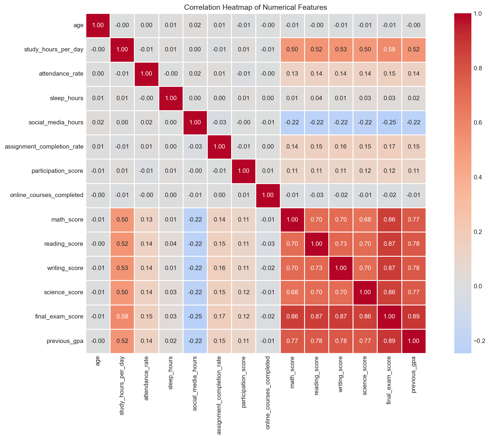
*Gambar 2. Heatmap Korelasi yang Menunjukkan Multikolinearitas antar Subject Scores*

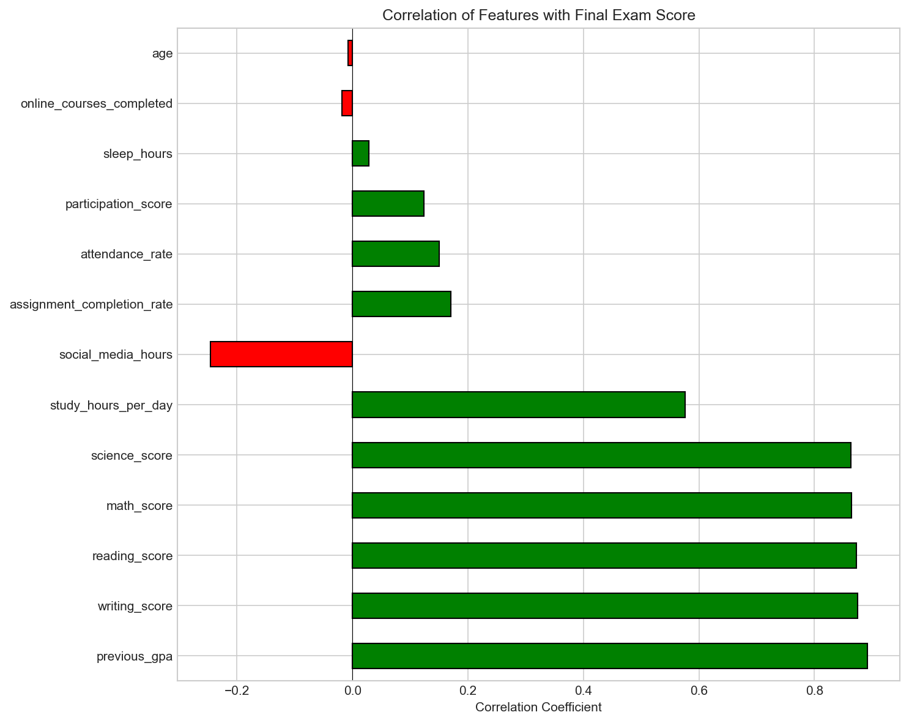
*Gambar 3. Bar Chart Korelasi Fitur dengan Final Exam Score*

**Kaitan dengan task:** Untuk task **regresi**, heatmap membantu memilih fitur yang tidak redundan agar model linear tetap stabil dan interpretable. Untuk task **klasifikasi** (baik biner maupun multi-class), heatmap membantu mendeteksi apakah ada leakage dari target variable lain. Tanpa visualisasi ini, seorang analis bisa saja memasukkan `final_exam_score` sebagai fitur untuk memprediksi `grade_category`, yang akan menghasilkan akurasi sempurna namun tidak bermakna.

---

### 3.2 Class Distribution Bar Chart

**Tujuan:** Mendeteksi ketidakseimbangan kelas sebelum modeling

**Karakteristik yang diatasi:** Severe Class Imbalance (Bagian 2.1)

Dengan 90% data berada di kelas D dan F, visualisasi distribusi kelas **wajib dilakukan sebelum** memulai proses modeling. Bar chart yang menampilkan A = 10, B = 85 versus F = 5.172 langsung memberikan sinyal kritis bahwa:

- **Accuracy bukan metrik yang tepat** untuk evaluasi model multi-class, karena sebuah model "bodoh" yang selalu menebak F saja sudah akan mendapat akurasi 51,7%
- **Strategi sampling khusus** (SMOTE, undersampling, atau oversampling) diperlukan untuk memastikan model juga belajar dari kelas minoritas
- Mungkin lebih realistis untuk **menggabungkan kelas** A+B+C menjadi satu kategori "Above Average" untuk mendapatkan distribusi yang lebih seimbang
- Metrik evaluasi seperti **F1-score** (weighted/macro), precision-recall per kelas, atau confusion matrix menjadi lebih informatif daripada accuracy tunggal

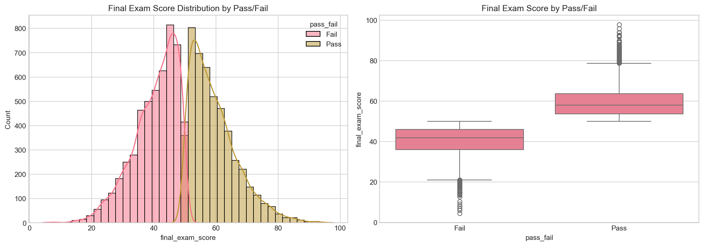
*Gambar 4. Distribusi Skor berdasarkan Pass/Fail yang Menunjukkan Keseimbangan Kelas Biner*

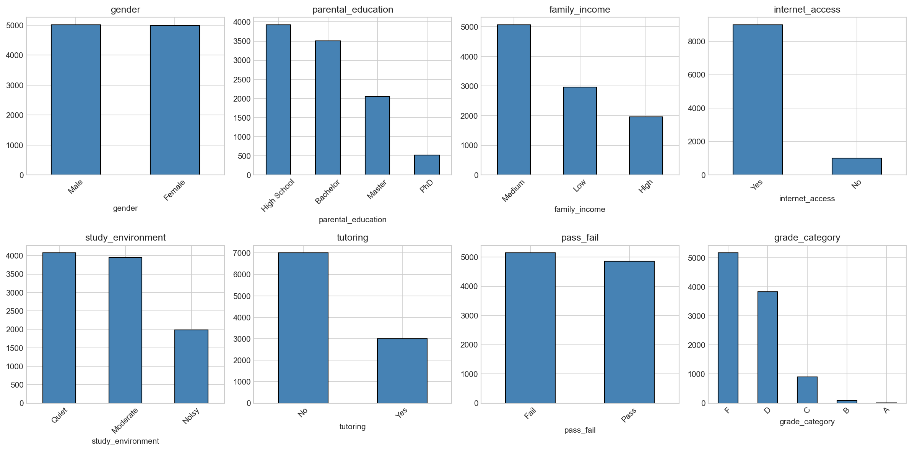
*Gambar 5. Distribusi Fitur-Fitur Kategorikal*

**Kaitan dengan task:** Untuk task **multi-class classification**, visualisasi ini menentukan seluruh strategi modeling. Tanpa visualisasi distribusi kelas, kita bisa salah menginterpretasi akurasi 100% sebagai model yang benar-benar baik, padahal kemungkinan besar itu merupakan hasil dari data leakage. Sebaliknya, untuk task **klasifikasi biner** (pass/fail), visualisasi menunjukkan distribusi yang hampir seimbang (48,6% vs 51,4%), sehingga tidak memerlukan penanganan khusus.

---

### 3.3 Scatter Plot & Regression Plot

**Tujuan:** Memahami bentuk hubungan antara prediktor dan target variable

**Karakteristik yang diatasi:** Multikolinearitas tinggi (Bagian 2.2) dan pemilihan fitur untuk regresi

Karena task utama dataset ini adalah memprediksi `final_exam_score` (regresi), scatter plot antara prediktor dan target sangat penting untuk menunjukkan:

- Apakah hubungan antara fitur dan target bersifat **linear**, seperti `previous_gpa` vs `final_exam_score` yang menunjukkan hubungan sangat linear (r = 0,89)
- Apakah ada pola **non-linear** yang membutuhkan transformasi fitur atau penggunaan model non-linear
- Apakah ada **cluster atau segmentasi** natural dalam data yang bisa dimanfaatkan
- Mengkonfirmasi secara visual bahwa korelasi tinggi dari subject scores bukan artefak statistik, melainkan memang hubungan linear yang kuat. Hal ini memperkuat kecurigaan bahwa variabel-variabel ini mungkin **terlalu informatif** (potential leakage)

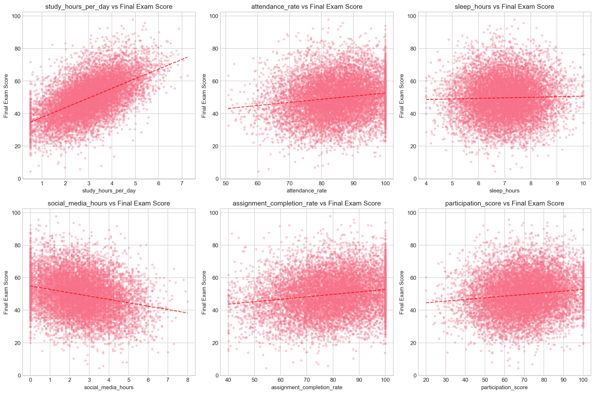
*Gambar 6. Scatter Plot Fitur vs Final Exam Score*

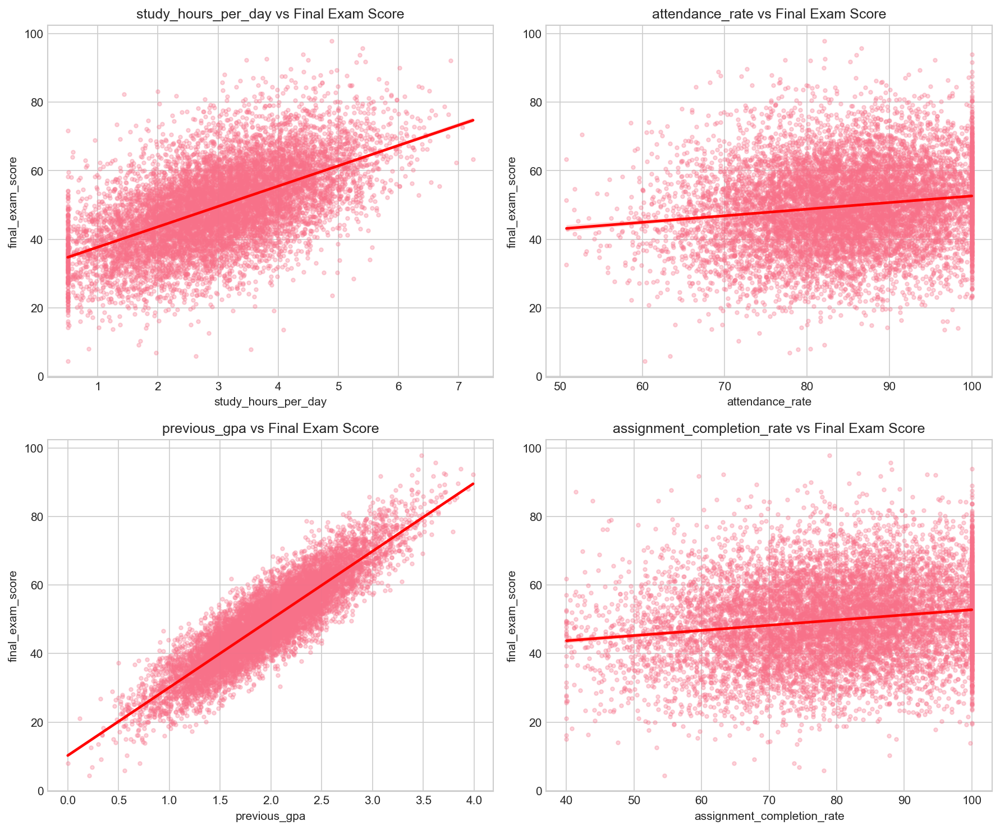
*Gambar 7. Regression Plot untuk Fitur-Fitur Utama*

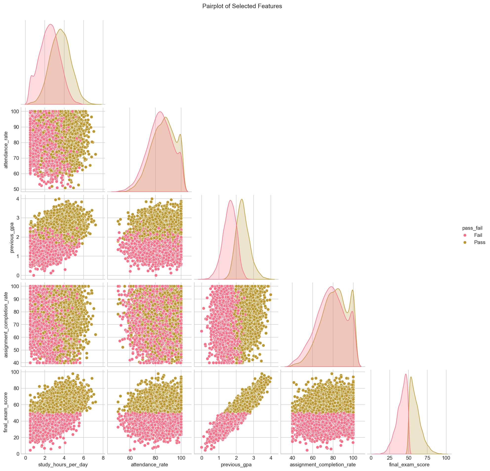
*Gambar 8. Pairplot Fitur-Fitur Terpilih*

**Kaitan dengan task:** Untuk task **regresi**, scatter plot memberikan konfirmasi visual yang tidak bisa diperoleh dari angka korelasi saja. Angka korelasi r = 0,89 menunjukkan hubungan kuat, tetapi scatter plot menunjukkan apakah hubungan tersebut benar-benar linear, apakah ada heteroskedastisitas, atau apakah ada outlier berpengaruh (influential points). Informasi ini krusial untuk memilih jenis model yang tepat, misalnya apakah cukup menggunakan Linear Regression atau perlu GradientBoosting yang lebih kompleks.

---

### 3.4 Box Plot untuk Outlier Detection

**Tujuan:** Mengidentifikasi dan mengevaluasi dampak outlier pada model

**Karakteristik yang diatasi:** Dataset sintetis/bersih (Bagian 2.4) dan kualitas data

Meskipun dataset ini bersih, box plot tetap merupakan visualisasi penting karena:

- `final_exam_score` memiliki **95 outlier** berdasarkan metode IQR. Outlier pada target variable sangat mempengaruhi performa model regresi, khususnya metrik RMSE
- Box plot mengkonfirmasi bahwa data sintetis ini memang memiliki noise minimal, yang penting untuk menetapkan ekspektasi terhadap performa model
- Untuk task regresi, outlier di target bisa menyebabkan RMSE tinggi meskipun model secara umum akurat pada mayoritas data. Box plot membantu memutuskan apakah outlier perlu dihapus atau di-cap (winsorize)

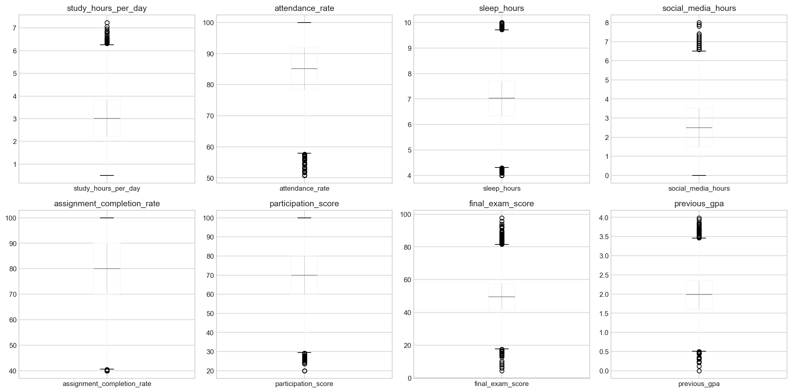
*Gambar 9. Box Plot Fitur-Fitur Utama untuk Outlier Detection*

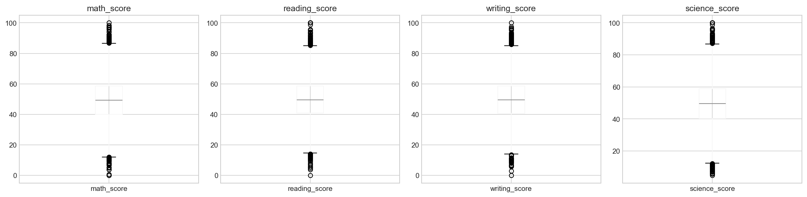
*Gambar 10. Box Plot Subject Scores*

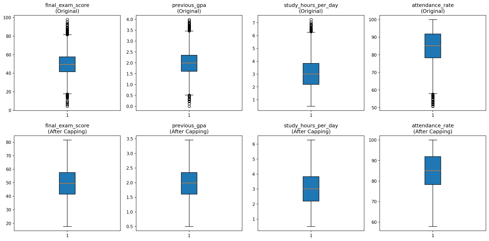
*Gambar 11. Perbandingan Sebelum dan Sesudah Outlier Handling*

**Kaitan dengan task:** Untuk task **regresi**, outlier secara langsung mempengaruhi fungsi loss (MSE/RMSE). Untuk task **klasifikasi**, outlier bisa menyebabkan decision boundary yang tidak optimal. Box plot memberikan panduan visual untuk memutuskan strategi penanganan outlier, yaitu apakah akan dihapus, di-winsorize, atau dibiarkan jika outlier tersebut merupakan data valid.

---

### 3.5 Ringkasan Prioritas Metode EDA

| Prioritas | Metode EDA | Karakteristik yang Diatasi | Task yang Terbantu |
|-----------|------------|----------------------------|---------------------|
| 1 | Correlation Heatmap & Bar Chart | Multikolinearitas & Leakage (Bagian 2.2 & 2.3) | Regresi & Klasifikasi |
| 2 | Class Distribution Chart | Severe Imbalance (Bagian 2.1) | Multi-class Classification |
| 3 | Scatter / Regression Plot | Hubungan Prediktor-Target (Bagian 2.2) | Regresi |
| 4 | Box Plot | Outlier pada Target (Bagian 2.4) | Regresi |

*Tabel 4. Prioritas Metode EDA berdasarkan Relevansi dengan Karakteristik Dataset dan Task*

---

## 4. Kesimpulan

Dari analisis yang dilakukan, dapat disimpulkan bahwa EDA bukan sekadar langkah deskriptif untuk "melihat data", melainkan proses kritis untuk **mendeteksi masalah sebelum modeling dimulai**. Dalam konteks dataset Student Exam Performance, empat karakteristik utama yang teridentifikasi, yaitu class imbalance yang parah, multikolinearitas tinggi, derived targets, dan sifat sintetis dataset, secara langsung mempengaruhi keberhasilan atau kegagalan setiap task machine learning.

Pemilihan metode EDA yang tepat harus didasarkan pada karakteristik spesifik dataset, bukan pada daftar standar yang diaplikasikan secara generik. Correlation heatmap menjadi visualisasi terpenting karena mampu mendeteksi multikolinearitas dan potensi leakage. Kedua masalah ini, jika tidak terdeteksi, akan menghasilkan model yang terlihat baik pada metrik evaluasi tetapi tidak memiliki nilai prediktif dalam skenario nyata.

**Poin terpenting dari laporan ini:** EDA yang baik seharusnya memunculkan *red flag*, seperti akurasi 100% pada multi-class classification dan korelasi >0,86 antar derived variables, yang menunjukkan potensi data leakage. Kemampuan mendeteksi anomali semacam ini jauh lebih berharga daripada menghasilkan visualisasi yang cantik tetapi tidak actionable.

---

*Laporan Tugas 3: EDA dan Data Visualization*
*Dataset Student Exam Performance, Telkom University 2026*
